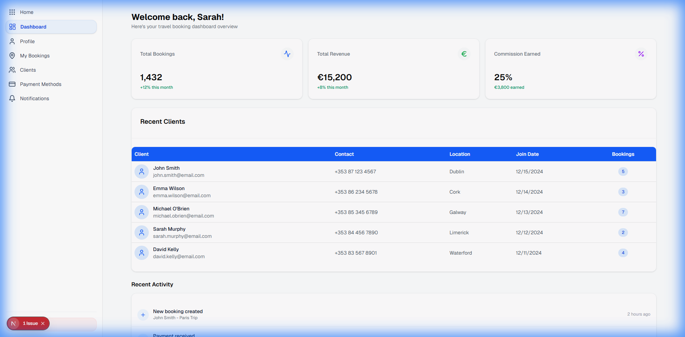
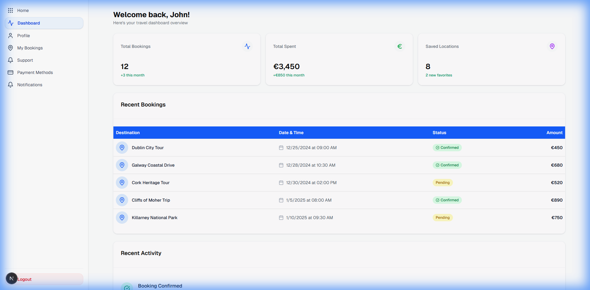
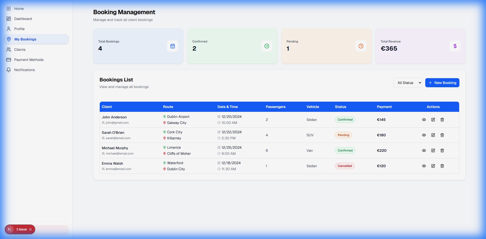
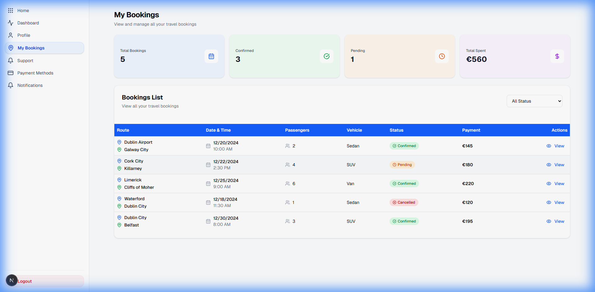

# IrelandGo - Travel Booking Platform

A modern, full-featured travel booking platform for Ireland built with Next.js 14, TypeScript, and Tailwind CSS. IrelandGo provides separate dashboards for travel agents and users to manage bookings, clients, payments, and more.

## 🌟 Features

### For Users
- **Dashboard Overview**: View booking statistics, recent bookings, and activity feed
- **Booking Management**: Create, view, and manage travel bookings with detailed information
- **Profile Management**: Update personal information and preferences
- **Payment Methods**: Securely add and manage payment methods
- **Notifications**: Real-time notifications for bookings, payments, and updates
- **Support**: Access customer support and help resources

### For Agents
- **Comprehensive Dashboard**: Monitor total bookings, revenue, and commission earnings
- **Client Management**: View and manage client information, booking history, and contact details
- **Booking Management**: Create and manage bookings for clients with full CRUD operations
- **Recent Clients Table**: Quick access to the 5 most recent clients
- **Activity Feed**: Track recent bookings, payments, and client registrations
- **Notifications**: Stay updated on new bookings, payments, and client activities
- **Payment Methods**: Manage payment options for seamless transactions

## � Screenshots

### Agent Dashboard

*Agent dashboard showing metrics, recent clients table with blue header, and activity feed*

### User Dashboard

*User dashboard with booking statistics, recent bookings table, and activity timeline*

### Agent Bookings Management

*Comprehensive booking management with statistics and filterable table*

### User Bookings

*User bookings page with blue header table showing trip details and status*

## �🚀 Tech Stack

- **Framework**: [Next.js](https://nextjs.org/) (App Router)
- **Language**: [TypeScript](https://www.typescriptlang.org/)
- **Styling**: [Tailwind CSS](https://tailwindcss.com/)
- **UI Components**: [shadcn/ui](https://ui.shadcn.com/)
- **Icons**: [Lucide React](https://lucide.dev/)
- **Form Handling**: React Hook Form (planned)

## 📋 Prerequisites

Before you begin, ensure you have the following installed:
- **Node.js**: v18.0.0 or higher
- **npm**: v9.0.0 or higher (or yarn/pnpm)
- **Git**: For version control


## 📁 Project Structure

```
IrelandGo-web/
├── app/                      # Next.js App Router
│   ├── agent/               # Agent dashboard routes
│   │   ├── bookings/        # Booking management
│   │   ├── clients/         # Client management
│   │   ├── notifications/   # Notifications page
│   │   ├── payment-methods/ # Payment methods page
│   │   ├── profile/         # Agent profile
│   │   ├── layout.tsx       # Agent layout with sidebar
│   │   └── page.tsx         # Agent dashboard
│   ├── user/                # User dashboard routes
│   │   ├── bookings/        # User bookings
│   │   ├── notifications/   # Notifications page
│   │   ├── payment-methods/ # Payment methods page
│   │   ├── profile/         # User profile
│   │   ├── support/         # Support page
│   │   ├── layout.tsx       # User layout with sidebar
│   │   └── page.tsx         # User dashboard
│   ├── layout.tsx           # Root layout
│   └── page.tsx             # Home page
├── components/              # Reusable components
│   ├── common/              # Shared components
│   │   ├── PageHeader.tsx   # Page header component
│   │   └── PaymentOnboardingSidebar.tsx
│   ├── layout/              # Layout components
│   └── ui/                  # UI components (shadcn/ui)
├── lib/                     # Utility functions
├── public/                  # Static assets
└── styles/                  # Global styles
```

## 🎨 Key Features Breakdown

### Dashboard Design
- **Metrics Cards**: Display key statistics with color-coded icons
- **Blue Table Headers**: Professional table design with rounded corners
- **Recent Activity**: Timeline view of recent actions
- **Responsive Layout**: Mobile-first design approach

### Booking System
- **Status Tracking**: Confirmed, Pending, Cancelled states
- **Route Display**: Visual pickup and destination indicators
- **Filter Options**: Filter by status, date, and more
- **Detailed Views**: Modal dialogs with complete booking information

### Client Management (Agent)
- **Client Profiles**: Comprehensive client information
- **Booking History**: Track total bookings and spending
- **Status Indicators**: Active/Inactive client status
- **Quick Actions**: View, edit, and delete operations

### Notifications
- **Real-time Updates**: Instant notifications for important events
- **Unread Indicators**: Blue dot and background for unread items
- **Mark as Read**: Individual and bulk mark as read options
- **Categorized**: Different icons for booking, payment, and client notifications

## 🔐 Authentication

Currently, the application uses route-based access:
- `/agent/*` - Agent dashboard routes
- `/user/*` - User dashboard routes

**Note**: Authentication system is planned for future implementation.

## 🎯 Usage

### For Agents

1. **Access Agent Dashboard**: Navigate to `/agent`
2. **View Metrics**: See total bookings, revenue, and commission
3. **Manage Clients**: Go to `/agent/clients` to view and manage clients
4. **Create Bookings**: Use the booking management system at `/agent/bookings`
5. **Check Notifications**: View updates at `/agent/notifications`

### For Users

1. **Access User Dashboard**: Navigate to `/user`
2. **View Bookings**: Check your bookings at `/user/bookings`
3. **Manage Profile**: Update information at `/user/profile`
4. **Add Payment Methods**: Securely add cards at `/user/payment-methods`
5. **Get Support**: Access help at `/user/support`

## 📝 License

This project is licensed under the MIT License - see the [LICENSE](LICENSE) file for details.

## 👥 Authors

- **TAIJULAMAN** - [GitHub Profile](https://github.com/TAIJULAMAN)


**Made with ❤️ for travelers exploring Ireland**
