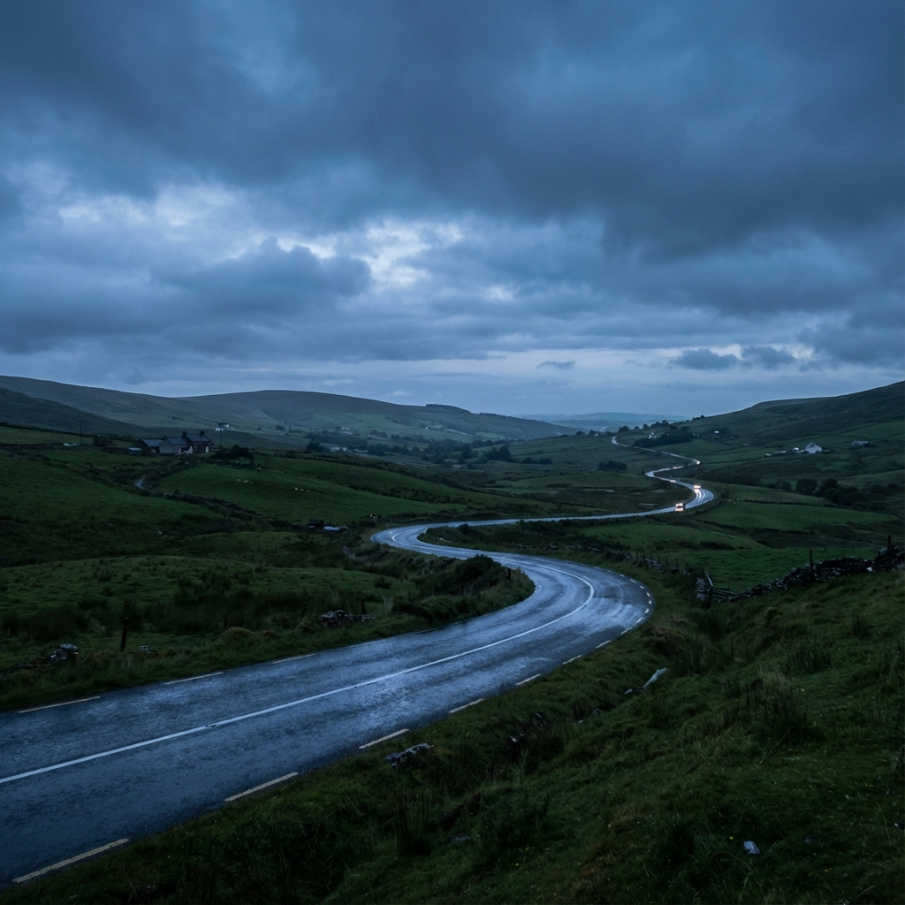
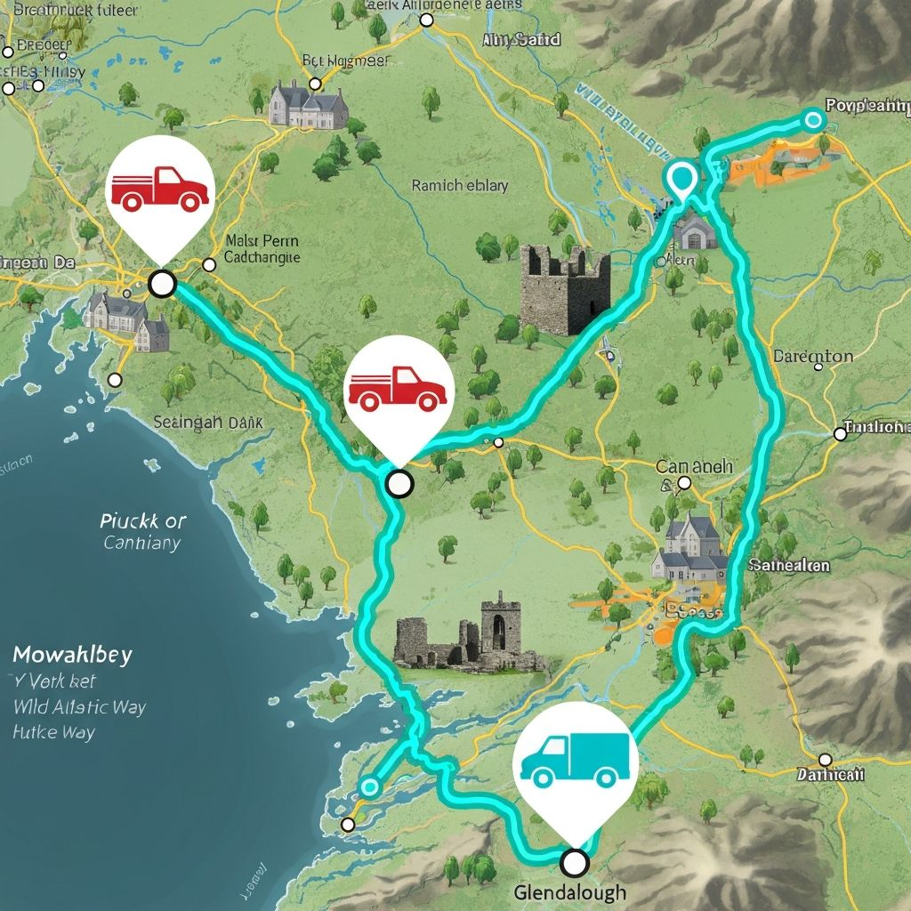

<div align="center">
  
  <h1>🇮🇪 IrelandGo - Premium Travel Booking Platform</h1>
  <p>A modern, full-featured travel booking platform for exploring Ireland, built with Next.js 16, TypeScript, and Tailwind CSS. IrelandGo offers comprehensive booking solutions for airport transfers, hourly rentals, day trips, and multi-day tours with separate dashboards for travel agents and users.</p>
</div>



---

##  Overview
IrelandGo redefines travel across the Emerald Isle by offering a seamless and luxurious booking experience. Whether you're an independent traveler organizing a bespoke day trip to the Cliffs of Moher, or a dedicated travel agent managing high-volume bookings for clients, IrelandGo's responsive design and highly optimized architecture ensures everything runs flawlessly.

##  Core Services

<details open>
<summary><b>1. Airport Transfers</b></summary>
<br/>


- **Route Planning**: Interactive map-based route selection with OpenStreetMap integration.
- **Journey Details**: Comprehensive trip information with distinct pickup/dropoff logic.
- **Transfer Routes**: Browse popular airport transfer routes effortlessly across Ireland.
- **Real-time Tracking**: Live tracking integration of your designated transfer vehicle.
</details>

<details open>
<summary><b>2. By the Hour Rentals</b></summary>
<br/>


- **Flexible Rentals**: Book vehicles by the hour for completely custom itineraries.
- **Multiple Stops**: Dynamically add multiple destinations to a single journey.
- **Professional Drivers**: Rely on local drivers with extensive knowledge of the Irish landscape.
</details>

<details open>
<summary><b>3. Day Trips & Multi-Day Tours</b></summary>
<br/>


- **Extensive Catalog**: Choose from over 1,500+ curated day trip packages.
- **Iconic Destinations**: See the Cliffs of Moher, Giant's Causeway, Galway, and more.
- **Detailed Itineraries**: Full schedule breakdowns with highlight attractions and activities.
- **Streamlined Booking**: Effortlessly navigate the booking flow from search to final confirmation.
</details>

---

##  Interactive Dashboards

Our custom dashboards separate concerns cleanly between end-users and professional travel agents.

###  User Dashboard
Your central hub for travel history and account configuration.
- **Overview**: View your booking statistics, recent trips, and account activity feed.
- **Management**: Quickly modify active bookings and review past travel details.
- **Profile & Preferences**: Adjust personal details, saved payment methods, and notification toggles effortlessly.

###  Agent Dashboard
A powerful suite designed specifically for travel agencies and independent agents to oversee their client base.
- **Analytics & Revenue**: Monitor total bookings, accumulated revenue, and real-time commission earnings.
- **Client CRM**: Manage client profiles, view individual booking histories, and maintain contact records.
- **Direct Booking**: Process and manage bookings directly on behalf of your clients.

---

##  Technology Stack

We've leveraged the cutting-edge of the React ecosystem to deliver a fast, reliable, and highly interactive application.


- **Framework**: [Next.js 16 (App Router)](https://nextjs.org/) 
- **Language**: [TypeScript 5](https://www.typescriptlang.org/)
- **Styling**: [Tailwind CSS 4](https://tailwindcss.com/)
- **UI Components**: [shadcn/ui](https://ui.shadcn.com/) utilizing Radix UI Primitives
- **Mapping Engine**: [Leaflet](https://leafletjs.com/) with React Leaflet
- **Forms & Validation**: [React Hook Form](https://react-hook-form.com/) combined with [Zod](https://zod.dev/)
- **Authentication**: Custom Redux Toolkit (RTK) based authentication system
- **State Management**: Redux Toolkit & RTK Query
- **Data Visualization**: [Recharts](https://recharts.org/)

---

##  Project Structure

```
IrelandGo-web/
├── app/                          # Next.js App Router
│   ├── about/                    # About page
│   ├── agent/                    # Agent dashboard routes
│   │   ├── bookings/             # Booking management
│   │   ├── clients/              # Client management
│   │   ├── notifications/        # Notifications page
│   │   ├── payment-methods/      # Payment methods page
│   │   ├── profile/              # Agent profile
│   │   ├── layout.tsx            # Agent layout with sidebar
│   │   └── page.tsx              # Agent dashboard
│   ├── airport-transfers/        # Airport transfer booking
│   │   ├── journey-details/      # Journey details page
│   │   ├── transfer-routes/      # Popular routes
│   │   └── page.tsx              # Airport transfers home
│   ├── auth/                     # Authentication pages
│   │   ├── login/                # Login page
│   │   ├── signup/               # Signup page
│   │   ├── forgot-password/      # Password recovery
│   │   ├── verify-code/          # Email verification
│   │   └── reset-password/       # Password reset
│   ├── booking-flow/             # Multi-step booking process
│   │   ├── step-2/               # Vehicle selection
│   │   ├── step-3/               # Booking details
│   │   ├── step-3-details/       # Additional details
│   │   ├── payment/              # Payment processing
│   │   ├── booking-confirmation/ # Confirmation page
│   │   └── real-time-tracking/   # Live tracking
│   ├── by-the-hour/              # Hourly rental service
│   ├── contact/                  # Contact page
│   ├── dashboard/                # Dashboard routes
│   │   ├── agent/                # Agent dashboard
│   │   └── user/                 # User dashboard
│   ├── day-trips/                # Day trips service
│   │   ├── day-trip-details/     # Trip details page
│   │   └── page.tsx              # Day trips home
│   ├── multi-day-tours/          # Multi-day tour packages
│   ├── settings/                 # Settings pages
│   │   ├── privacy-policy/       # Privacy policy
│   │   └── terms-of-service/     # Terms of service
│   ├── transfer/                 # Transfer services
│   │   ├── private-car-transfer/ # Private transfers
│   │   └── transfer-search/      # Search transfers
│   ├── user/                     # User dashboard routes
│   │   ├── bookings/             # User bookings
│   │   ├── dashboard/            # User dashboard
│   │   ├── notifications/        # Notifications page
│   │   ├── payment-methods/      # Payment methods page
│   │   ├── profile/              # User profile
│   │   ├── saved/                # Saved trips
│   │   ├── support/              # Support page
│   │   ├── layout.tsx            # User layout with sidebar
│   │   └── page.tsx              # User home
│   ├── layout.tsx                # Root layout
│   ├── page.tsx                  # Home page
│   └── globals.css               # Global styles
├── components/                   # Reusable components
│   ├── airport-transfers/        # Airport transfer components
│   ├── auth/                     # Authentication components
│   ├── booking-flow/             # Booking flow components
│   ├── by-the-hour/              # Hourly rental components
│   ├── common/                   # Shared components
│   │   ├── header.tsx            # Site header
│   │   ├── footer.tsx            # Site footer
│   │   └── PageHeader.tsx        # Page header component
│   ├── day-trips/                # Day trip components
│   │   ├── day-trips-hero.tsx    # Hero section
│   │   └── day-trips-details/    # Detail components
│   ├── home/                     # Home page components
│   ├── layout/                   # Layout components
│   ├── multi-day-tours/          # Multi-day tour components
│   └── ui/                       # UI components (shadcn/ui)
├── contexts/                     # React contexts
│   └── BookingContext.tsx        # Booking state management
├── hooks/                        # Custom React hooks
│   ├── use-mobile.tsx            # Mobile detection hook
│   └── use-toast.ts              # Toast notification hook
├── lib/                          # Utility functions
│   └── utils.ts                  # Helper utilities
├── public/                       # Static assets
│   ├── ireland-hero-bg.jpg       # Hero background images
│   ├── cliffs-of-moher-*.jpg     # Destination images
│   └── ...                       # Other assets
├── styles/                       # Global styles
│   └── globals.css               # Global CSS
├── components.json               # shadcn/ui configuration
├── next.config.mjs               # Next.js configuration
├── tailwind.config.ts            # Tailwind CSS configuration
├── tsconfig.json                 # TypeScript configuration
└── package.json                  # Project dependencies
```

---

##  Getting Started

To get a local copy up and running, follow these simple steps.

### Prerequisites
Make sure you have Node.js and npm installed on your local machine.
- Node.js (v18.0.0 or higher recommended)
- npm (v9.0.0 or higher)

### Installation

1. **Clone the repository**
   ```bash
   git clone https://github.com/TAIJULAMAN/IrelandGo-website.git
   ```

2. **Install dependencies**
   ```bash
   cd IrelandGo-website
   npm install
   ```

3. **Start the development server**
   ```bash
   npm run dev
   ```

4. **Open the Application**
   Navigate to [http://localhost:3000](http://localhost:3000) in your web browser.

---

##  Design Philosophy



### Modern Aesthetics
- **Glassmorphism**: Soft, frosted glass effects for modals and interactive layers.
- **Gradients**: Deep rich UI gradients for headers and banners reflecting modern premium travel.
- **Micro-interactions**: Subtle hover scaling and layout animations powered by `tailwindcss-animate`.

### Component Modularity
The codebase is structured to maximize reusability. Dashboards, for instance, are composed of strictly separated atomic components (`ProfileHeaderBanner`, `DashboardMetrics`, `RecentBookingsTable`) acting under orchestrator page components. 

---

## 📝 License

Distributed under the MIT License. See `LICENSE` for more information.

<div align="center">
  <b>Made with ❤️ for travelers exploring the beauty of Ireland 🇮🇪</b>
</div>
